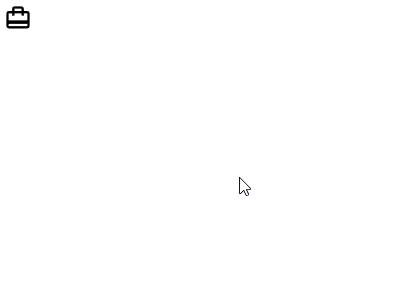

# react-iconify-list

:construction: Under development :construction:

> ...

[](https://www.npmjs.com/package/react-iconify-list) [](https://standardjs.com)





## Install

```bash
npm install --save react-iconify-list
```

## Usage

```jsx
...
```


## Props

| Prop                   | Type                | Required | Default       | Note                                                                                                                                                                                                         |
| ---------------------- | ------------------- | -------- | ------------- | ------------------------------------------------------------------------------------------------------------------------------------------------------------------------------------------------------------ |
| onChange               | EventHandler        | **Yes**  |               | Event Handler
| icon                   | string              | No       |               | Selected Icon
| iconList               | Array of string     | No       |               | Array of strings containing icons. Eg: `["material-symbols:account-balance", "material-symbols:add-shopping-cart", "material-symbols:account-tree-outline"]`
| sizeButton             | string              | No       | medium        | Size of button.


## License

MIT © [israelpossoli](https://github.com/israelpossoli)
